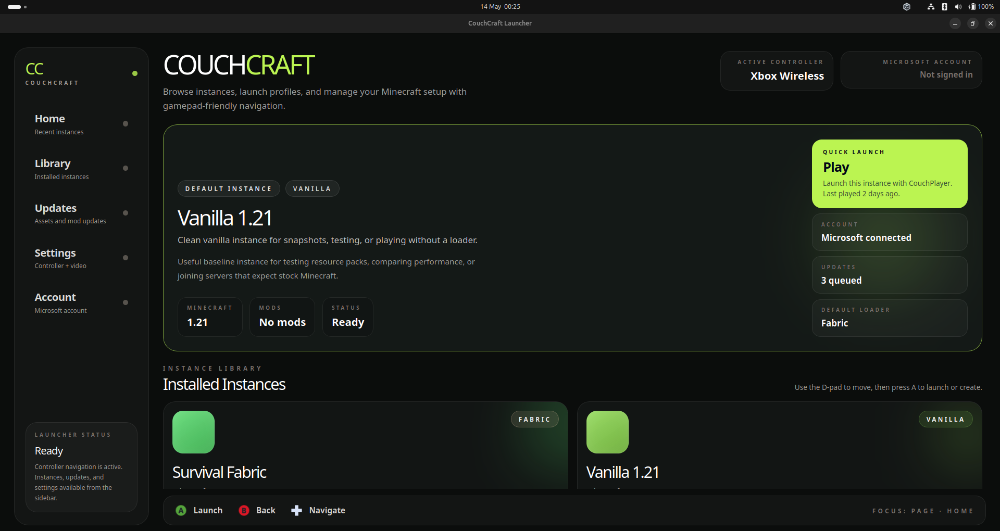

# CouchCraft



A 10-foot Minecraft launcher built for the couch. Gamepad-first, TV-ready, and designed to feel at home next to your console.

Built with [Tauri 2](https://tauri.app), React, TypeScript, and Tailwind CSS.

## Features

- **Gamepad-first navigation** — full D-pad and button support, hold-to-repeat, haptic feedback
- **Instance management** — create, launch, recolor, and delete Minecraft instances
- **Loader support** — Fabric, Quilt, Forge, NeoForge, and Vanilla
- **Microsoft authentication** — device code flow, no TV keyboard needed
- **UI sound feedback** — configurable click sounds and volume
- **10-foot UI** — large text, high contrast, designed for a TV at distance

## Stack

| Layer | Tech |
|---|---|
| App framework | Tauri 2 |
| Frontend | React + TypeScript + Vite |
| Styling | Tailwind CSS |
| Database | SQLite via tauri-plugin-sql |
| Gamepad | tauri-plugin-gamepad + gilrs |
| Auth | Microsoft OAuth2 device code flow |

## Getting Started

### Prerequisites

- [Rust](https://rustup.rs)
- [Node.js](https://nodejs.org) 18+
- Linux with a desktop environment (Wayland or X11)

### Install & run

```bash
git clone https://github.com/YOUR_USERNAME/CouchCraft.git
cd CouchCraft/tauri-app
npm install
npm run tauri dev
```

### Build

```bash
npm run tauri build
```

## Microsoft Authentication

CouchCraft uses the [Microsoft OAuth2 device code flow](https://learn.microsoft.com/en-us/entra/identity-platform/v2-oauth2-device-code) — no keyboard required. A short code is displayed on screen and entered on your phone at the URL shown.

To use your own Azure app registration for Minecraft auth, you will need approval from Microsoft:
[Apply here](https://forms.cloud.microsoft/Pages/ResponsePage.aspx?id=v4j5cvGGr0GRqy180BHbR-ajEQ1td1ROpz00KtS8Gd5UNVpPTkVLNFVROVQxNkdRMEtXVjNQQjdXVC4u)

## License

MIT
